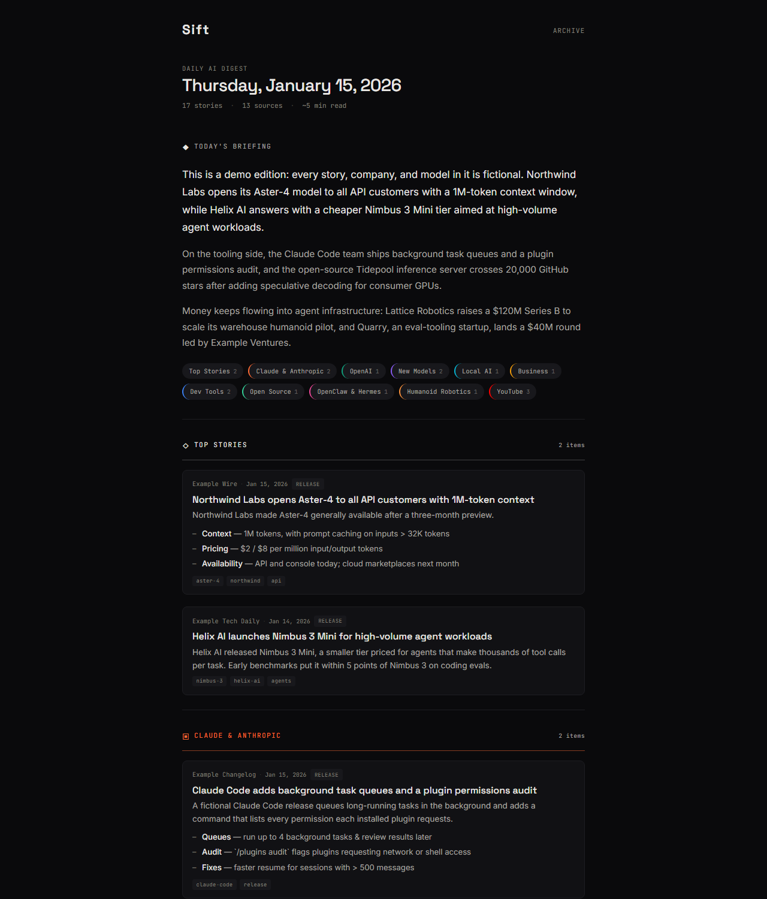
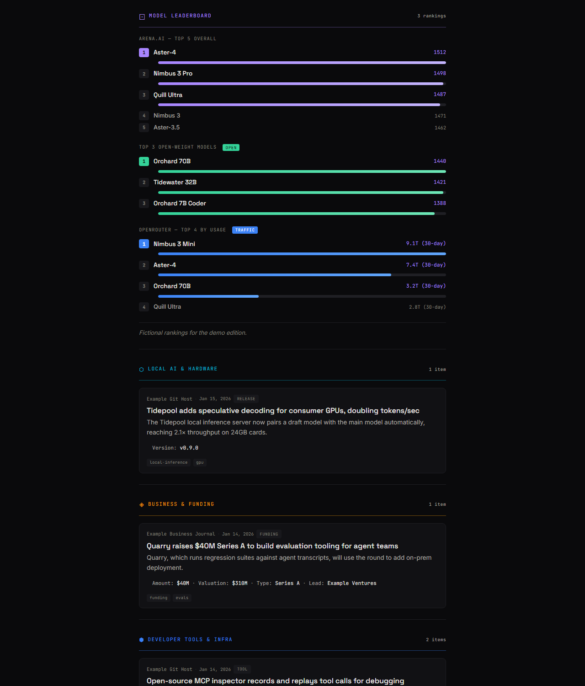
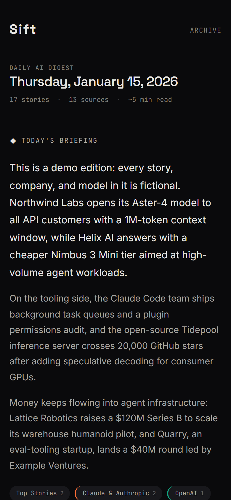
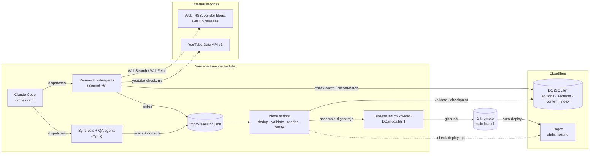
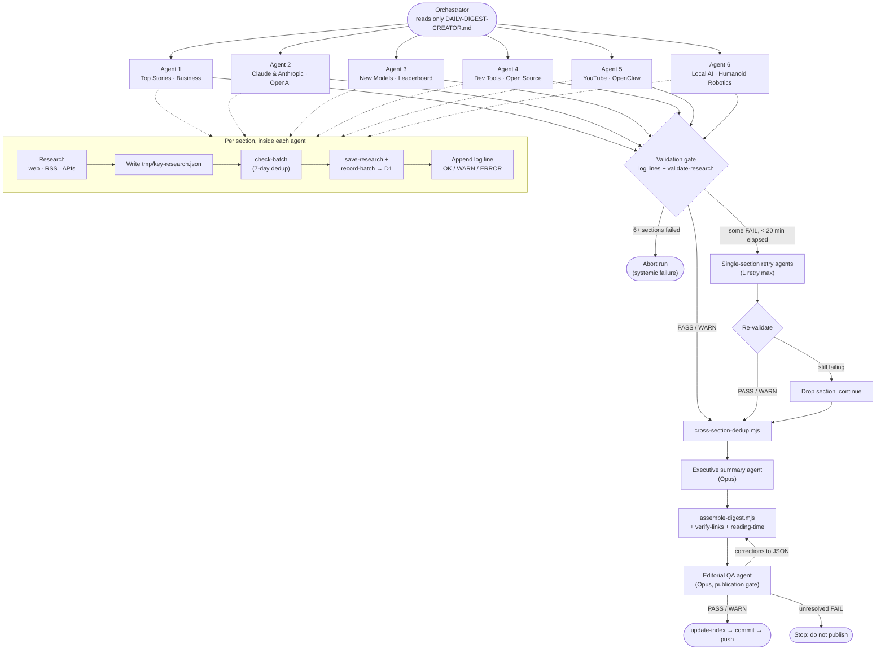
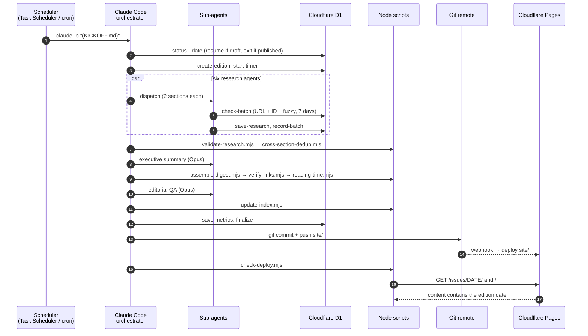
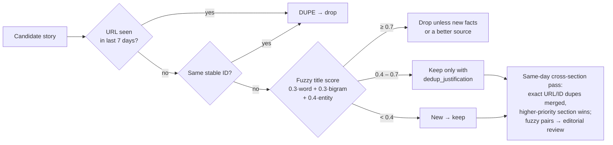

# Sift — a self-hosted, agent-built daily AI digest

Sift publishes a daily briefing on the AI industry as a single, fast, dark-themed HTML page. A Claude Code orchestrator fans out parallel research sub-agents that search the web, rewrite headlines, and summarize sources into structured JSON. The JSON then goes through deterministic gates: dedup against a 7-day history in Cloudflare D1, schema validation, link checks, and an editorial QA agent. A plain Node renderer turns it into HTML, which is committed to git and auto-deployed on Cloudflare Pages.

The design splits the work cleanly: **AI researches and writes; code renders and verifies.** Agents never write HTML, and nothing publishes without passing a scripted gate.



<p align="center">
  
  
</p>

<sub>Screenshots show a fictional demo edition (`examples/demo-edition.json`). Every company, model, and story in it is invented. Regenerate them with `npm run screenshots`.</sub>

---

## Features

- **Parallel research fan-out.** Six Sonnet sub-agents each cover two of the twelve sections, following a shared brief plus their section's rules. An Opus agent writes the executive summary, and a second Opus agent runs final editorial QA.
- **Deterministic rendering.** [`scripts/assemble-digest.mjs`](scripts/assemble-digest.mjs) is the only source of markup. Research JSON is the contract between the agents and the renderer, so changing the look never means changing a prompt.
- **Cross-day and cross-section dedup.** URL, stable-ID, and entity-weighted fuzzy title matching against 7 days of history in D1, then a same-day pass across sections with a section-priority rule for which copy survives.
- **Scripted quality gates.** Research validation, link verification with retry and backoff, reading-time and story-count consistency checks, and a publication gate that blocks on any unresolved editorial `FAIL`.
- **Crash-tolerant runs.** Every section writes a mandatory log line, so a silent sub-agent crash is detected rather than published around. Each section gets one retry, and the run stops outright on systemic failure (6+ sections failing). Partial runs resume from D1 checkpoints.
- **Token discipline.** The orchestrator reads a single instruction file, sub-agents read only their own briefs, and D1 dedup and recording are batched to one call per section.
- **Zero-build static hosting.** Output is one self-contained HTML file per day with inlined CSS and no framework. Cloudflare Pages serves `site/` as is, noindex by default.
- **YouTube creator tracking** through the YouTube Data API v3, with Shorts filtered out.

## Sections

| Section | Covers |
|---|---|
| Executive Summary | A 3–7 paragraph briefing synthesized from everything below |
| Top Stories | The day's biggest AI headlines |
| Claude & Anthropic | Claude Code releases, API and product changes |
| OpenAI & ChatGPT | Model, product, and API updates |
| New Models & Benchmarks | Model releases, evals, SOTA results |
| Model Leaderboard | Arena top 10, top open-weight models, OpenRouter usage |
| Local AI & Hardware | Self-hosted inference, quantization, GPUs |
| Business & Funding | Rounds, acquisitions, partnerships |
| Developer Tools & Infra | Agent tooling, MCP servers, frameworks |
| Open Source Highlights | Trending repositories and community projects |
| OpenClaw & Hermes | Releases and security news for these agent platforms |
| Humanoid Robotics | Humanoid hardware, pilots, and funding |
| YouTube Creators | New uploads from a curated creator list |

Each section's research rules live in [`instructions/research/`](instructions/research/). Change the sources, scope, or creator list there.

---

## Architecture



| Layer | Responsibility | Where |
|---|---|---|
| Orchestration | Phases, budgets, retries, publication decisions | [`instructions/DAILY-DIGEST-CREATOR.md`](instructions/DAILY-DIGEST-CREATOR.md) |
| Research | Find, verify, rewrite, and summarize stories into schema-valid JSON | [`instructions/RESEARCH_BRIEF.md`](instructions/RESEARCH_BRIEF.md), [`instructions/research/*.md`](instructions/research/) |
| Editorial | Voice and quality rules; final QA gate | [`docs/CONTENT-POLICY.md`](docs/CONTENT-POLICY.md), [`instructions/EDITORIAL_QA_BRIEF.md`](instructions/EDITORIAL_QA_BRIEF.md) |
| State | Edition lifecycle, research checkpoints, 7-day content index | [`scripts/d1-save.mjs`](scripts/d1-save.mjs), [`scripts/d1-init.mjs`](scripts/d1-init.mjs) |
| Rendering | JSON → HTML, CSS inlined, homepage and archive regenerated | [`scripts/assemble-digest.mjs`](scripts/assemble-digest.mjs), [`scripts/update-index.mjs`](scripts/update-index.mjs), [`template/css/sift.css`](template/css/sift.css) |
| Verification | Schema gate, link checks, reading metrics, deploy check | [`scripts/validate-research.mjs`](scripts/validate-research.mjs), [`scripts/verify-links.mjs`](scripts/verify-links.mjs), [`scripts/reading-time.mjs`](scripts/reading-time.mjs), [`scripts/check-deploy.mjs`](scripts/check-deploy.mjs) |

### Agent fan-out

The orchestrator dispatches six research agents concurrently, each owning a fixed pair of sections. Each agent processes its pair in order and ends each section with a mandatory log line. The validation gate checks those lines, so a missing line is treated as a crash.



The run has a hard 45-minute wall-clock budget with checkpoints at 20, 28, and 40 minutes. Past each one the orchestrator degrades: it skips retries, then the summary, then the QA correction loop. It never skips link verification or an editorial `FAIL`.

### A daily run end to end



### Deduplication

A story can repeat across days (yesterday's news resurfacing) or across sections (the same launch found by two agents). The two passes handle each case separately:



Entity matching uses the aliases in [`data/entities.json`](data/entities.json), so "Claude Code 2.1 ships hooks" and "Anthropic updates Claude Code with hooks" share the `anthropic` entity and score 0.55 despite little word overlap. A shared entity is weighted heavily but is never proof of duplication. Two unrelated OpenAI stories also land around 0.43. That is why the 0.4–0.7 band asks the agent for a written justification instead of dropping the story, and why same-day fuzzy pairs go to the editorial agent rather than being merged automatically. Source tiers (1 = official, 4 = community) are stored with every recorded item.

---

## Getting started

### Prerequisites

- Node.js 22+
- [Claude Code](https://docs.claude.com/en/docs/claude-code/overview), signed in. Research uses its WebSearch and WebFetch tools.
- A Cloudflare account (free plan works) for D1 and Pages
- Optional: a YouTube Data API v3 key for the YouTube section

### Try it without any accounts

The demo renders a complete site from fictional data. It needs no API keys, no D1, and no network access.

```bash
git clone https://github.com/<you>/ai-newsletter.git
cd ai-newsletter
npm install
npm run demo          # writes dist/demo/site/
npm test              # unit tests + demo render tests
```

Open `dist/demo/site/issues/2026-01-15/index.html` in a browser. Root-relative links such as the archive work when you serve `dist/demo/site/` over HTTP.

### Full setup

1. **Configure credentials**
   ```bash
   cp .env.example .env.local
   ```
   Fill in the values (see [Configuration](#configuration)). `.env.local` is gitignored.
2. **Create D1 and Pages.** Follow [`docs/CLOUDFLARE-SETUP.md`](docs/CLOUDFLARE-SETUP.md), then:
   ```bash
   npm run init-db
   ```
3. **Check the YouTube key** (optional):
   ```bash
   node scripts/test-youtube-key.mjs
   ```
4. **Make it yours.** Edit the reader profile in [`CLAUDE.md`](CLAUDE.md), the voice guide in [`docs/CONTENT-POLICY.md`](docs/CONTENT-POLICY.md), per-section sources in [`instructions/research/`](instructions/research/), and the creator watchlist in [`scripts/youtube-check.mjs`](scripts/youtube-check.mjs).
5. **Run an edition.** Open Claude Code in the repository and paste the contents of [`KICKOFF.md`](KICKOFF.md).

### Configuration

All settings are environment variables, read from `.env` and then `.env.local`:

| Variable | Required | Purpose |
|---|---|---|
| `CF_ACCOUNT_ID` | yes | Cloudflare account ID |
| `CF_API_TOKEN` | yes | API token with **Account → D1 → Edit** |
| `CF_D1_DATABASE_ID` | yes | D1 database UUID |
| `SITE_URL` | no | Public site URL (e.g. `https://example.com`). Used for canonical and `og:url` tags and by `check-deploy.mjs`; tags are omitted when unset |
| `YOUTUBE_API_KEY` | no | Enables the YouTube Creators section |

Sub-agents cannot read environment variables directly, so every script loads `.env.local` itself. Agents call scripts; they never handle keys.

### Scheduling

- **Windows:** point a Task Scheduler task at [`scripts/run-daily-digest.cmd`](scripts/run-daily-digest.cmd). It runs from the repository root and appends to `daily-run.log`. Set `CLAUDE_EXE` if `claude` is not on the task's PATH.
- **macOS / Linux (cron):**
  ```cron
  0 6 * * * cd /path/to/ai-newsletter && claude -p "$(cat KICKOFF.md)" --dangerously-skip-permissions >> daily-run.log 2>&1
  ```

> **Security note:** unattended runs use `--dangerously-skip-permissions`, which lets the agent run any tool without asking. Run the scheduler under a dedicated low-privilege account or in a container, and give the git remote a deploy key scoped to this one repository.

### Deployment

Deploys are git-driven. The pipeline commits `site/issues/<date>/`, `site/index.html`, and `site/issues/index.html`, then pushes `main`, and Cloudflare Pages publishes `site/`. There is no build command. [`scripts/check-deploy.mjs`](scripts/check-deploy.mjs) then confirms the edition is live by checking page content, because Pages answers HTTP 200 for any path.

The site is **noindex by default** (`site/_headers`, `site/robots.txt`). See [`docs/CLOUDFLARE-SETUP.md`](docs/CLOUDFLARE-SETUP.md#6-keep-it-private-default-or-make-it-public) for making it private or public.

---

## Commands

```bash
# Pipeline tools (the orchestrator calls these; all safe to run by hand)
node scripts/validate-research.mjs --date YYYY-MM-DD [--json]
node scripts/cross-section-dedup.mjs --date YYYY-MM-DD [--dry-run]
node scripts/assemble-digest.mjs --date YYYY-MM-DD [--research-dir DIR] [--out-dir DIR]
node scripts/update-index.mjs [--site-dir DIR]
node scripts/verify-links.mjs --date YYYY-MM-DD
node scripts/reading-time.mjs --date YYYY-MM-DD [--json]
node scripts/check-deploy.mjs --date YYYY-MM-DD
node scripts/youtube-check.mjs --hours 24 --json

# D1 state (full list in CLAUDE.md)
node scripts/d1-save.mjs status [--date YYYY-MM-DD]
node scripts/d1-save.mjs check-batch --file tmp/KEY-research.json
node scripts/d1-save.mjs reset-edition --date YYYY-MM-DD
node scripts/d1-save.mjs purge-old --days 30
```

[`scripts/mcp-server.mjs`](scripts/mcp-server.mjs) exposes the D1 commands as `sift_*` MCP tools for interactive Claude Code sessions (configured in [`.mcp.json`](.mcp.json)). Sub-agents use the CLI.

## Tests

```bash
npm test
```

Uses Node's built-in test runner. There are no test dependencies. Coverage:

- **Fuzzy matching and dedup:** scoring weights, entity overlap, thresholds, and winner selection
- **Link checking:** URL extraction, retry with bounded backoff, and hard 404s
- **Reading metrics:** word counts, reading time, and singular/plural labels
- **Rendering:** builds the demo edition through the real assembler and index updater, then checks sections, HTML escaping of scraped text, canonical-tag behavior, and the homepage's latest link

Screenshots are reproducible. `npm run screenshots` renders the demo, serves it locally, and captures it with Playwright using a fixed clock, timezone, locale, and viewport. Outside requests are blocked except Google Fonts. On first use, run `npx playwright install chromium`.

---

## Project layout

```
.
├── KICKOFF.md                      # One-line prompt that starts a run
├── CLAUDE.md                       # Project guide for coding agents (AGENTS.md points here)
├── instructions/
│   ├── DAILY-DIGEST-CREATOR.md     # Orchestrator: phases, gates, budgets, recovery
│   ├── RESEARCH_BRIEF.md           # Shared rules for every research agent (schema, dedup, tiers)
│   ├── EDITORIAL_QA_BRIEF.md       # Final publication gate
│   └── research/NN-section.md      # Per-section sources and scope
├── scripts/
│   ├── assemble-digest.mjs         # Research JSON → HTML (single source of markup)
│   ├── update-index.mjs            # Homepage + archive regeneration
│   ├── d1-save.mjs / d1-init.mjs   # D1 CLI and schema
│   ├── mcp-server.mjs              # D1 as MCP tools
│   ├── validate-research.mjs       # Phase 1.5 gate
│   ├── cross-section-dedup.mjs     # Same-day dedup across sections
│   ├── verify-links.mjs            # Link verification
│   ├── reading-time.mjs            # Reading metrics
│   ├── check-deploy.mjs            # Post-push live check
│   ├── youtube-check.mjs           # YouTube Data API watcher
│   ├── render-demo.mjs             # Demo site from fictional data
│   ├── screenshots.mjs             # Playwright README screenshots
│   ├── run-daily-digest.cmd        # Windows Task Scheduler launcher
│   └── shared/                     # fuzzy, dedup, link-check, reading-metrics (+ tests)
├── template/css/sift.css           # Digest stylesheet, inlined at render time
├── site/                           # Cloudflare Pages root (editions land in site/issues/)
├── data/entities.json              # Entity dictionary for fuzzy dedup
├── examples/demo-edition.json      # Fictional demo data
└── docs/
    ├── CLOUDFLARE-SETUP.md         # D1 + Pages setup
    ├── CONTENT-POLICY.md           # Editorial voice guide
    ├── screenshots/                # README images (generated)
    ├── *token-optimization*.md     # How the pipeline's token use was cut
    └── superpowers/                # Design specs and implementation plans
```

## Design notes

- **Why no AI design phase?** Earlier versions had agents write HTML fragments per section. That was the most expensive phase and the least consistent one. Moving all markup into a deterministic renderer cut tokens, made output byte-for-byte reproducible from the same JSON, and made the design editable in one CSS file.
- **Why D1 instead of local files?** Dedup needs history across machines and runs, and crash recovery needs checkpoints that outlive `tmp/`. D1 gives both through a plain REST API, with no server to run.
- **Why log lines as a liveness signal?** A sub-agent that times out often returns nothing at all. Requiring each section to append a log line turns "missing output" into a detectable failure instead of a quietly thinner edition.
- The docs under [`docs/superpowers/`](docs/superpowers/) and the token-optimization write-ups record how these decisions were made.

## License

Copyright (C) 2026 Sift contributors.

Licensed under the [GNU Affero General Public License v3.0 only](LICENSE) (`AGPL-3.0-only`). You may use, modify, and run it, including commercially. If you run a modified version as a network service, you must make your modified source available to its users.

Linked articles and videos belong to their publishers. Digest summaries are AI-generated from those sources.
